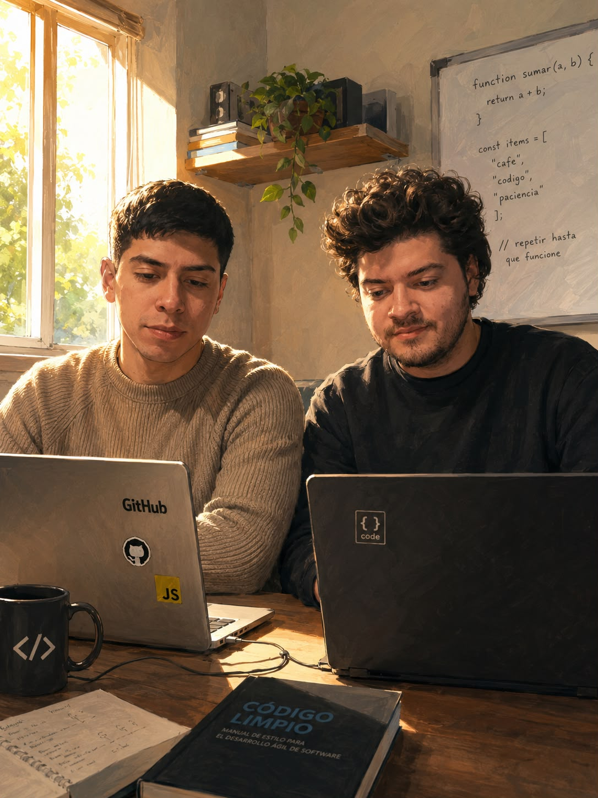

<h1>🎓 TPO-POO-UADE-2026</h1>

<h2>👋 Sobre nosotros</h2>

<table>
  <tr>
    <td width="50%" valign="top">

Somos un grupo de estudiantes de **Lic. en Gestión de Tecnología de la Información de UADE**, cursando la materia **Paradigma Orientado a Objetos**.

Este repositorio contiene el desarrollo de nuestro **Trabajo Práctico**, en el cual aplicamos los conceptos de **Programación Orientada a Objetos** vistos durante el cuatrimestre.

Nuestro objetivo es poner en práctica los conocimientos adquiridos durante la cursada mediante el desarrollo de una aplicación basada en los principios de la POO.

  </td>

  <td width="50%" align="center">

  </td>
  </tr>
</table>

<h2>🎯 Objetivos del proyecto</h2>

  

  - Aplicar los principios de POO (encapsulamiento, herencia, polimorfismo, abstracción). 
  - Practicar trabajo colaborativo mediante control de versiones con Git y GitHub. 
  - Diseñar el sistema utilizando diagramas UML antes de implementarlo. 
  - Entregar un producto funcional, documentado y probado. 
  

<h2>🧑‍🤝‍🧑 El equipo </h2>

<table align="center">
  <tr>
    <td align="center">
       
      <b>Gonzalo Orellana</b> 
      <a href="https://github.com/GonzaloOrellana">@GonzaloOrellana</a> 
      💡 Conocimientos: Python, Desarrollo Web, Figma 
      ❤️ Le gusta: fútbol, videojuegos, gym
    </td>
    <td align="center">
       
      <b>Nombre Apellido</b> 
      <a href="[https://github.com/usuario2](https://github.com/BorisArt)">@usuario2</a> 
      💡 Conocimientos: Python, Java 
      ❤️ Le gusta: futbol
    </td>
  </tr>
</table>

<h2>🛠️ Tecnologías utilizadas</h2>

<table align="center">
  <tr>
    <td align="center">
      
    </td>
    <td width="50"></td>
    <td align="center">
      
    </td>
  </tr>
</table>

<h2>✅ Estado del proyecto</h2>
  

  - [x] Configuración del repositorio. 
  - [x] Clase 1. 
  - [x] Ejercicios de Clase 2. 
  - [ ] Clase 3. 
  - [ ] Entrega final. 
  

